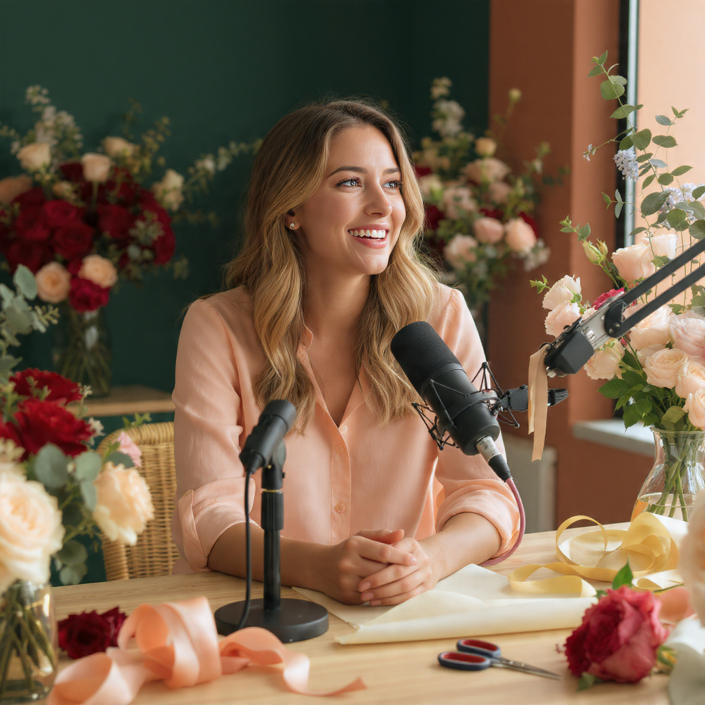

# 🎙️ Conexão Criativa: Podcast Gerado por IA

<p align="center">

</p>

<p align="center">
<a href="https://dio.me/">
    
</a>
<a href="https://www.santander.com.br/">
    
</a>
<a href="https://www.universia.net/">
    
</a>
</p>

<p align="center">
🎧 <strong>Episódio Disponível no YouTube</strong> 🎧
</p>

<div align="center">
<a href="https://www.youtube.com/watch?v=zXvtniLgoTY">

</a>
</div>

## 📋 Sobre o Projeto

> ℹ️ **NOTE:** Este projeto foi desenvolvido como parte do **Programa Trainee Santander 2026** em parceria com a [DIO](https://dio.me) e **Universia**, explorando as possibilidades da IA generativa na criação de conteúdo.

**Conexão Criativa** é um podcast que investiga o impacto da Inteligência Artificial no universo artístico, promovendo um debate equilibrado entre tradição e inovação. O primeiro episódio aborda o tema **"Pinceladas vs Pixels: O Debate Humano na Era Digital"**.

## 🎯 Episódio 1: Pinceladas vs Pixels

**Tema:** A arte tradicional enfrentando a revolução da IA generativa
**Duração:** 18-20 minutos
**Formato:** Entrevista descontraída entre apresentador e artista convidado
**Convidado:** Eduardo Lima - Artista plástico com 20+ anos de experiência

### 🎧 Preview do Podcast
<div align="center">
    <audio src="output/podcast_editado.MP3" controls title="Podcast editado"></audio>
</div>

## 🛠️ Tecnologias Utilizadas

### 🤖 IA Generativa
- [**DeepSeek**](https://www.deepseek.com/) - Roteirização e engenharia de prompts
- [**ElevenLabs**](https://beta.elevenlabs.io/) - Síntese de voz e geração de áudio
- [**Leonardo AI**](https://leonardo.ai/) - Criação de artes e capas

### 🎬 Produção
- [**CapCut**](https://www.capcut.com/pt-br/) - Edição de áudio e vídeo
- [**Audacity**](https://www.audacityteam.org/) - Tratamento de áudio
- [**YouTube Studio**](https://studio.youtube.com/) - Publicação e analytics

## 🎨 Processo Criativo

### 1. 📝 **Roteirização com IA**
- Desenvolvimento de prompts estruturados
- Criação de personagens e diálogos
- Definição de tom e estilo conversacional

### 2. 🎙️ **Geração de Áudio**
- Síntese de vozes distintas para cada personagem
- Ajuste de entonação e emoção nas falas
- Mixagem e tratamento de áudio

### 3. 🖼️ **Design Visual**
- Criação da identidade visual "Conexão Criativa"
- Desenvolvimento da capa do podcast no **Leonardo AI**
- Elementos gráficos para redes sociais

### 4. 🎬 **Edição Final**
- Inserção de vinhetas e efeitos sonoros
- Sincronização de áudio e legendas
- Otimização para plataformas de streaming

## 📂 Estrutura do Projeto


## 🚀 Como Reproduzir

### Pré-requisitos
- Conta no [DeepSeek](https://www.deepseek.com/)
- Acesso ao [ElevenLabs](https://beta.elevenlabs.io/)
- Conta no [Leonardo AI](https://leonardo.ai/)
- Software de edição de áudio/vídeo

</br>
</br>

### Passo a Passo

1. **Roteiro** 🤖
   ```bash
   # Use os prompts disponíveis na pasta /prompts
   # Gere o script completo com DeepSeek

```bash


2. ** Áudio 🎙️
 
    ```bash
    # Importe o script no ElevenLabs
    # Selecione vozes distintas para cada personagem
    # Exporte os arquivos de áudio
 ```bash

</br>
</br>

3. ** Artes 🎨
```bash
# Use os prompts de design no Leonardo AI
# Gere a capa e materiais visuais
```bash

</br>
</br>

4. **Edição ✂️
    ```bash
    # Importe áudios no CapCut/Audacity
    # Adicione trilha sonora e efeitos
    # Exporte o vídeo final
```bash


</br>
</br>

## 📚 Materiais de Apoio
    - 📺 Episódio no YouTube

    - 📋 Template de Prompts
    
    - 🎬 Editor CapCut
    
    - 📄 Documentação Completa

</br>
</br>

## 🔗 Links Importantes
     - 📂 Repositório no GitHub

    - 👤 Meu LinkedIn

    - 🎓 Programa Trainee Santander 2026

</br>
</br>


## 👨‍💻 Desenvolvedor
<p>  <p>&nbsp&nbsp&nbspFelipe Aguiar<br> &nbsp&nbsp&nbsp <a href="https://github.com/felipeAguiarCode">GitHub</a> &nbsp;|&nbsp; <a href="www.linkedin.com/in/felipe-exe">LinkedIn</a> &nbsp;|&nbsp; <a href="https://www.instagram.com/felipeaguiar.exe/">Instagram</a> &nbsp;</p> </p>


## 📄 Licença
Este projeto foi desenvolvido para fins educacionais como parte do Programa Trainee Santander 2026.


