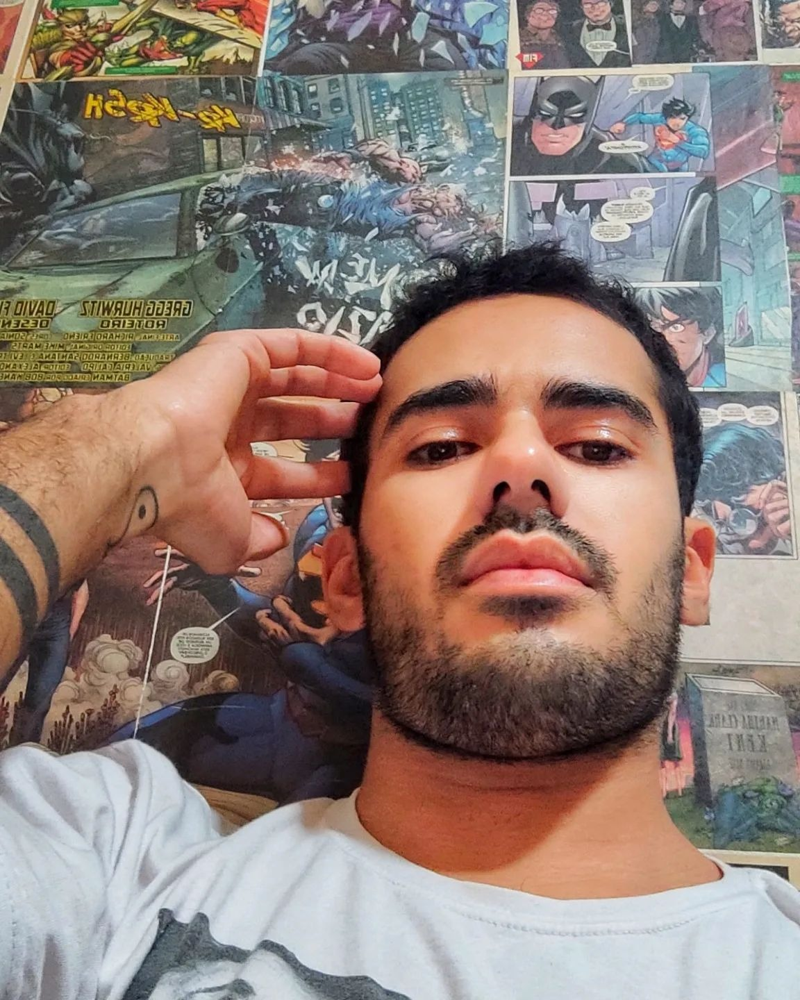

# 🎙️ Conexão Criativa: Podcast Gerado por IA

<p align="center">

</p>

</br>

<p align="center">
<a href="https://dio.me/">
    
</a>
<a href="https://www.santander.com.br/hotsite/traineesantander/">
    
</a>
<a href="https://www.universia.net/br/home">
    
</a>
</p>

<p align="center">
🎧 <strong>Episódio Disponível em:</strong> 🎧
</p>

<div align="center">
<a href="https://youtu.be/zXvtniLgoTY">

</a>

<div align="center">
<a href="https://soundcloud.com/pedro-augusto-956201243/conexao-criativa-episodio-1-a-ia-vai-substituir-artistas-o-debate-que-todo-criativo-precisa-ouvir">

</a>

<div align="center">
<a href="https://open.spotify.com/show/4xqdstiAoaOGapPd6707Xg?si=I-ma0mRaSR2j9bsMPkKWUg">

</a>
</div>

</div>
</div>

</br>

## 📋 Sobre o Projeto

</br>

> ℹ️ **NOTE:** Este projeto foi desenvolvido como parte do [**Programa Trainee Santander 2026**](https://www.santander.com.br/hotsite/traineesantander/) em parceria com a [**DIO**](https://dio.me) e [**Universia**](https://www.universia.net/br/home), explorando as possibilidades da IA generativa na criação de conteúdo.

</br>

**Conexão Criativa** é um podcast que investiga o impacto da Inteligência Artificial no universo artístico, promovendo um debate equilibrado entre tradição e inovação. O primeiro episódio aborda o tema **"Pinceladas vs Pixels: O Debate Humano na Era Digital"**.

</br>

## 🎯 Episódio 1: Pinceladas vs Pixels

**Tema:** A arte tradicional enfrentando a revolução da IA generativa
**Duração:** 5 - 7 minutos
**Formato:** Entrevista descontraída entre apresentador e artista convidado
**Convidado:** Eduardo Lima - Artista plástico com 20+ anos de experiência

</br>

## 🎧 Preview do Podcast
[🎙️ Ouvir o Episódio](https://github.com/apedrodev1/prompts-for-podcast-generate-by-ia/tree/main/output/final%20audio)

</br>

## 🛠️ Tecnologias Utilizadas

### 🤖 IA Generativa
- [**DeepSeek**](https://www.deepseek.com/) - Roteirização e engenharia de prompts
- [**ElevenLabs**](https://beta.elevenlabs.io/) - Síntese de voz e geração de áudio
- [**Leonardo AI**](https://leonardo.ai/) - Criação de artes e capas

- [**Gemini - VEO 3**](https://gemini.google/overview/video-generation/?hl=pt-BR) - Criação de vídeos.

</br>

### 🎬 Produção
- [**CapCut**](https://www.capcut.com/pt-br/) - Edição de áudio e vídeo
- [**Audacity**](https://www.audacityteam.org/) - Tratamento de áudio
- [**YouTube Studio**](https://studio.youtube.com/) - Publicação e analytics

</br>

## 🎨 Processo Criativo


### 1. 📝 **Roteirização com IA**
- Desenvolvimento de prompts estruturados
- Criação de personagens e diálogos
- Definição de tom e estilo conversacional

</br>

### 2. 🎙️ **Geração de Áudio**
- Síntese de vozes distintas para cada personagem
- Ajuste de entonação e emoção nas falas
- Mixagem e tratamento de áudio

</br>

### 3. 🖼️ **Design Visual**
- Criação da identidade visual "Conexão Criativa"
- Desenvolvimento da capa do podcast no **[Leonardo AI](https://leonardo.ai/)**
- Elementos gráficos para redes sociais


</br>

### 4. 🎬 **Edição Final**
- Inserção de vinhetas e efeitos sonoros
- Sincronização de áudio e legendas
- Otimização para plataformas de streaming
- Criação audiovisual [**Gemini - VEO 3**](https://gemini.google/overview/video-generation/?hl=pt-BR)


</br>

## 📂 Estrutura do Projeto

```bash
PROMPTS-FOR-PODCAST-GENERATION/
│ 
├── assets/
│   ├── img/
│   │   ├── broadcasterPodcast.jpg
│   │   ├── coverPodcast.jpg
│   │   ├── interviewedPodcast.jpg
│   │   ├── studioPodcast-1.png
│   │   └── studioPodcast-2.png
│   └── video/
│       └── podcastVideo.mp4
│
├── output/
│   ├── audio raw podcast/
│   │   ├── Interviewed/
│   │   └── Broadcaster/
│   ├── captions/
│   │   └── caption-pt-br.txt
│   └── final audio/
│       └── conexao-criativa-ep1.mp4
│
├── src/
│   └── prompts/
│       ├── deepSeekFinalScript.md
│       ├── deepSeekPodcastName.md
│       ├── deepSeekPodcastScript.md
│       ├── geminiVideo.md
│       ├── lioAiBroadcasterPic.md
│       ├── lioAiCoverImage.md
│       ├── lioAiInterviewed.md
│       └── lioAiStudio.md
│
├── .gitignore
└── README.md

```

</br>

## 🚀 Como Reproduzir

### Pré-requisitos
- Conta no [DeepSeek](https://www.deepseek.com/)
- Acesso ao [ElevenLabs](https://beta.elevenlabs.io/)
- Conta no [Leonardo AI](https://leonardo.ai/)
- Conta no [Gemini - VEO 3](https://gemini.google/overview/video-generation/?hl=pt-BR)
- Software de edição de áudio/vídeo

---


### Passo a Passo

</br>

1. **Roteiro** 🤖
   ```bash
   # Use os prompts disponíveis na pasta /prompts
   # Gere o script completo com DeepSeek
   ```

</br>

2. **Áudio** 🎙️
   ```bash
   # Importe o script no ElevenLabs
   # Selecione vozes distintas para cada personagem
   # Exporte os arquivos de áudio
   ```

</br>

3. **Artes** 🎨
   ```bash
   # Use os prompts de design no Leonardo AI
   # Gere a capa e materiais visuais
   ```

</br>

4. **Edição** ✂️
   ```bash
   # Importe áudios no CapCut/Audacity
   # Adicione trilha sonora e efeitos
   # Exporte o vídeo final
   ```
</br>

5. **Vídeo** 🎥
   ```bash
   # Acesse o Gemini - VEO 3
   # Importe a capa e materiais visuais gerados
   # Forneça o roteiro como guia de narrativa
   # Configure estilo visual e duração
   # Gere a versão final em vídeo do podcast
---


</br>


## 📚 Material de Apoio
- 📄 [Documentação Completa](https://github.com/felipeAguiarCode/prompts-for-podcast-generate-by-ia)
- 📋 [Template de Prompts](https://github.com/apedrodev1/prompts-for-podcast-generate-by-ia/tree/main/src/prompts)  

---

</br>

## 👨‍💻 Desenvolvedor

<p align="center">
  
</p>

<p align="center">
  <b>Pedro Augusto</b>  
  <br>
  <a href="https://github.com/apedrodev1">GitHub</a> &nbsp;|&nbsp;
  <a href="https://www.linkedin.com/in/pedro-augusto-rocha-548b28110/">LinkedIn</a> &nbsp;|&nbsp;
  <a href="https://www.instagram.com/apedrorocha/">Instagram</a>
</p>


---

</br>

## 📄 Licença
Este projeto foi desenvolvido para fins educacionais como parte do [**Programa Trainee Santander 2026**](https://www.santander.com.br/hotsite/traineesantander/) .


