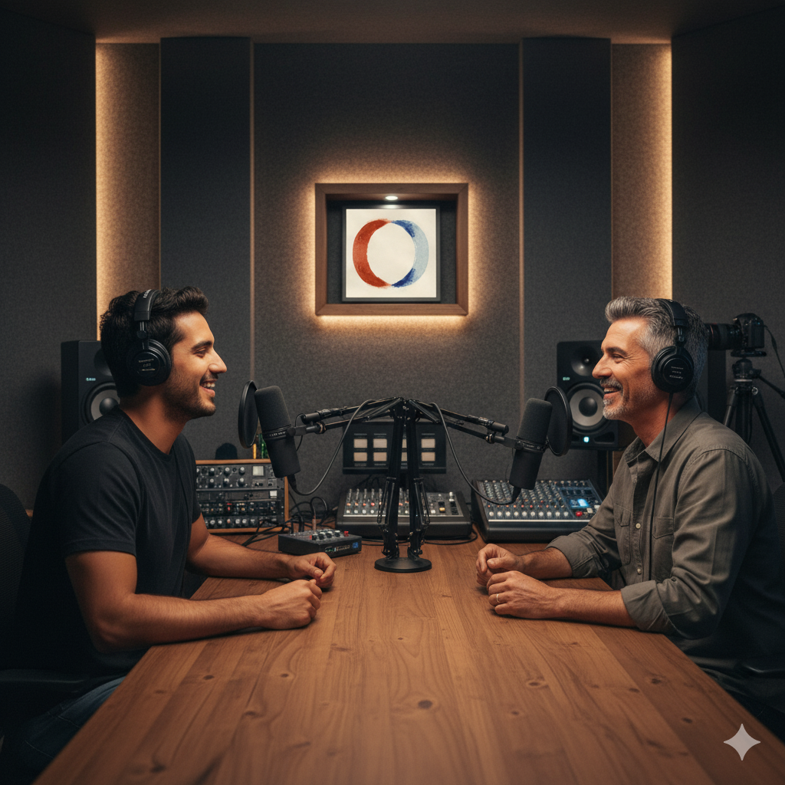
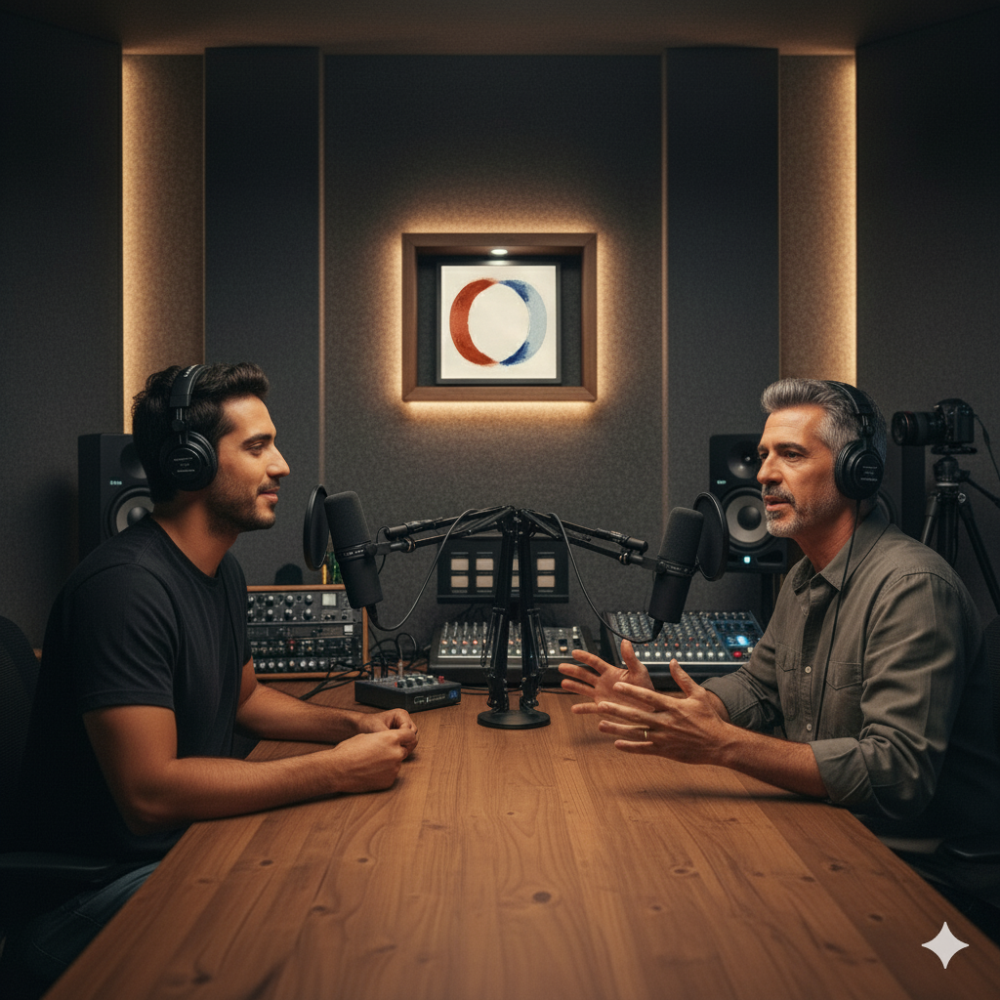

## 🧠 Prompts - Desenvolvimento da identidade visual do ambiente, com os Personagens.

## [Gemini VEO 3](https://gemini.google.com/app?hl=pt-BR)：

|   Ação   | Video Prompt |
| :------: | ------------------------------------------------------------------------------------------------------------------------------------------------------------------------------------------------------------------------------------------------------------------------------ |
| Criação audiovisual do Podcast | "Cena cinematográfica no estúdio do podcast 'Conexão Criativa', momento específico da entrevista onde Eduardo Lima, com expressão séria e reflexiva, fala a frase: 'Essa é a grande questão do nosso tempo. Veja, artistas sempre se inspiraram uns nos outros...' Enquanto Eduardo fala com convicção, gesticulando com as mãos para enfatizar seus pontos, o apresentador acena com a cabeça em concordância, mantendo contato visual atento e expressão de compreensão. A câmera faz um movimento suave entre os dois, focando alternadamente no rosto expressivo de Eduardo e nas reações empáticas do apresentador. Iluminação dramática que destaca a seriedade do momento, com sombras suaves que acentuam as expressões faciais. Atmosfera de conversa profunda e reflexiva."

 

## Anexos:

 

    Elementos de Performance:
        - Expressão facial de Eduardo: séria, reflexiva, levemente preocupada
        - Movimentos de mãos: amplos e expressivos
        - Reação do apresentador: acenos sutis, expressão empática, contato visual intenso
        - Linguagem corporal: inclinação frontal demonstrando engajamento

 

    Configurações Técnicas:
        - Duration: 7 - 8 seconds
        - Style: Cinematic, dramatic    lighting
        - Aspect Ratio: 16:9
        - Camera: Slow alternating close-ups between speakers

 

    Negative Prompt: 
        - Expressões exageradas, 
        - Movimentos bruscos,     
        - Iluminação plana, 
        - Falta de sincronia no diálogo"

 

| Resposta | Visualização |
| :------: | ------------------------------------------------------------------------------------------------------------------------------------------------------------------------------------------------------------------------------------------------------------------------------ |
| Resultado | 
 |
