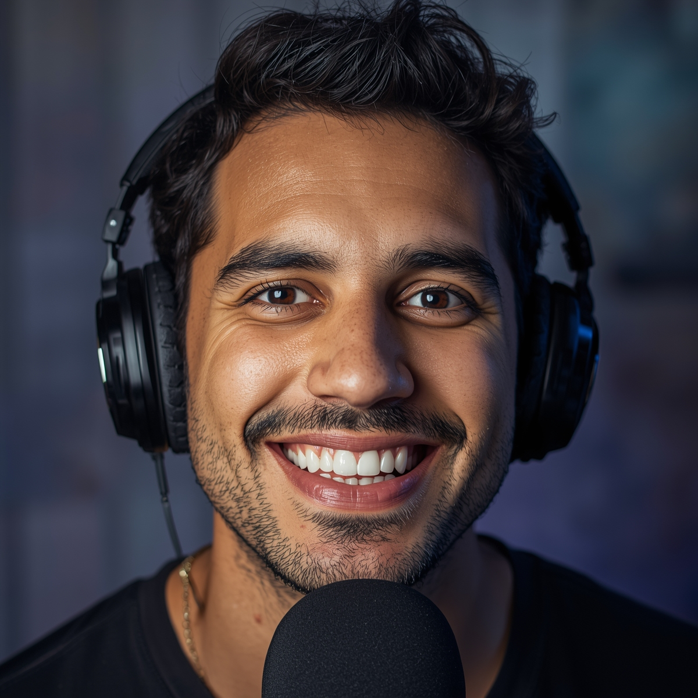

## 🧠 Prompts - Desenvolvimento da identidade visual do Apresentador.

## [LeonardoIA](https://leonardo.ai/)：

|   Ação   | Prompt |
| :------: | ------------------------------------------------------------------------------------------------------------------------------------------------------------------------------------------------------------------------------------------------------------------------------ |
| Criação da identidade visual do apresentador | **Imagem:** Close-up de um apresentador de podcast brasileiro, 30 anos, sorriso aberto e expressão animada, usando fones de ouvido profissionais, iluminação de estúdio suave, fundo com parede de tijolos à vista e equipamentos de áudio, estilo descontraído mas profissional, cores vibrantes, fotografia realista, detalhes nítidos nos olhos e expressão facial 

 

    Negative  Prompt: rosto borrado, iluminação ruim, expressão séria, fundo poluído, qualidade baixa

    Configurações sugeridas:
        - Model: Leonardo Diffusion XL  
        - Style: Dynamic
        - Resolution: 1024x1024 |

 
 

| Resposta | Visualização |
| :------: | ------------------------------------------------------------------------------------------------------------------------------------------------------------------------------------------------------------------------------------------------------------------------------ |
| Resultado | 

 |