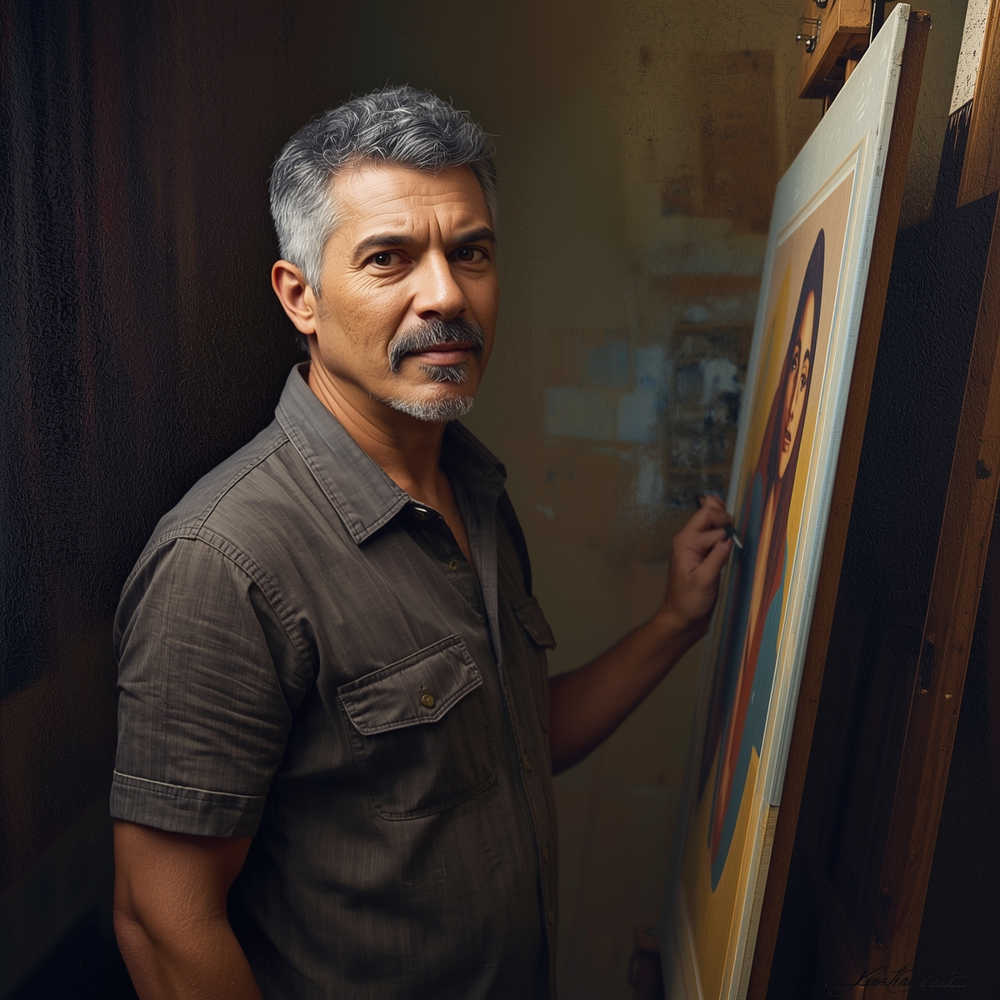

## 🧠 Prompts - Desenvolvimento da identidade visual do Entrevistado - Eduardo.

## [LeonardoIA](https://leonardo.ai/)：

|   Ação   | Prompt |
| :------: | ------------------------------------------------------------------------------------------------------------------------------------------------------------------------------------------------------------------------------------------------------------------------------ |
| Criação da identidade visual do entrevistado | **Imagem:** Retrato de um artista plástico brasileiro maduro, 45 anos, cabelos grisalhos, expressão sábia e contemplativa, vestindo camisa social casual, segurando um pincel, fundo de ateliê artístico com telas e cavalete, iluminação quente e acolhedora, estilo realista com texturas de tinta visíveis, profundidade de campo suave.

 

    Negative Prompt: pessoa jovem, expressão vazia, roupas formais, fundo limpo, estilo cartoon

    Configurações sugeridas:
        - Model: Leonardo Diffusion XL  
        - Style: Dynamic
        - Resolution: 1024x1024 |

 
 

| Resposta | Visualização |
| :------: | ------------------------------------------------------------------------------------------------------------------------------------------------------------------------------------------------------------------------------------------------------------------------------ |
| Resultado | 

 |